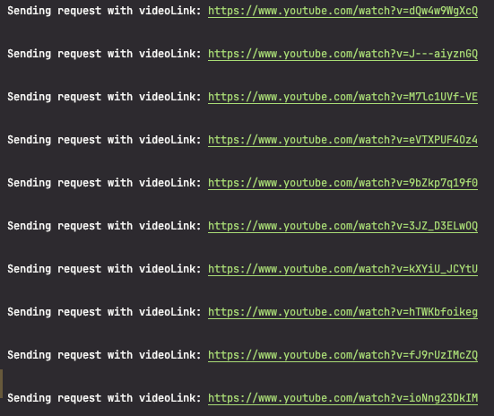
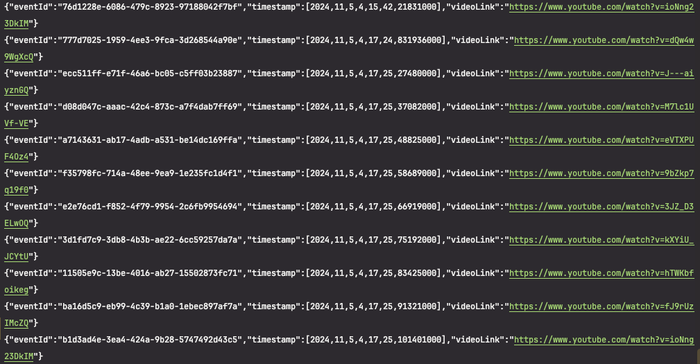

# ApiServer

## ApiServer to STTServer

스크립트를 이용해 curl 요청
```bash
chmod +x http.sh
./http.sh
```




topic 에 produce 한 메시지 확인

```bash
docker exec -it kafka /bin/bash
kafka-console-consumer --bootstrap-server localhost:9092 --topic note-link-events --from-beginning
```




```
kafka-topics --describe --topic llm-commentary-events --bootstrap-server localhost:9092

kafka-console-producer --broker-list localhost:9092 --topic llm-commentary-events
```